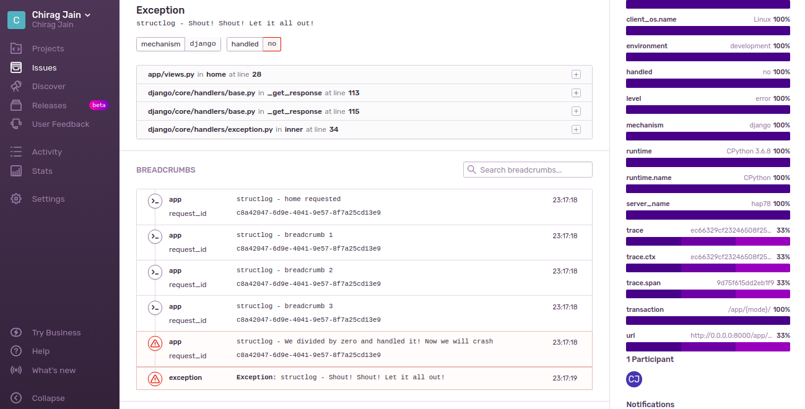

A minimal Django app for running [sentry](https://sentry.io/) along with [structlog](structlog.org) json logging setup

 

JSON structured messages make Sentry issues and breadcrumbs hard to read, but are great for parsing and aggregating in ELK stack. 
We do some hacking around with structlog and sentry internals to make them work together nicely

- [x] Send plain text string log events instead of json/dict events to Sentry  
- [x] Send plain text string breadcrumb events instead of json/dict events to Sentry
- [x] Save traceback to `LogRecord.exc_info` when using structlog so Sentry can extract it
- [x] Allow copying custom keys from event_dict to LogRecord attributes so Sentry can put it as extra (E.g. see `request_id` in the above screenshot)
- [ ] Get `'_meta'` key in Sentry event json when using structlog  

Other related projects that attempt to solve this problem:

- [structlog-sentry](https://github.com/kiwicom/structlog-sentry)

---

To run (sorry no docker or uwsgi here):

Needs Python 3.6+

1. Install requirements (preferrably in a virtual environment)

    ```shell
    pip install -r requirements.txt
    ```

2. Sign up for sentry, create a project and get a DSN

3. Copy `.env.template` to `.env`

    ```shell
    cp .env.template .env
    ```

4. Edit `.env` with your favorite editor and paste your Sentry DSN

    ```
    SENTRY_DSN=https://{...}@{...}.ingest.sentry.io/{...}
    ```

5. Run the dev server
 
    ```shell
    python manage.py runserver 0.0.0.0:8000
    ```

6. Go create errors
    - http://0.0.0.0:8000/app/structlog
    - http://0.0.0.0:8000/app/stdlib

7. Go explore the code at [setup_logs](./sentry_structlog_experiments/setup_logs.py) and [setup_sentry](./sentry_structlog_experiments/setup_sentry.py)
